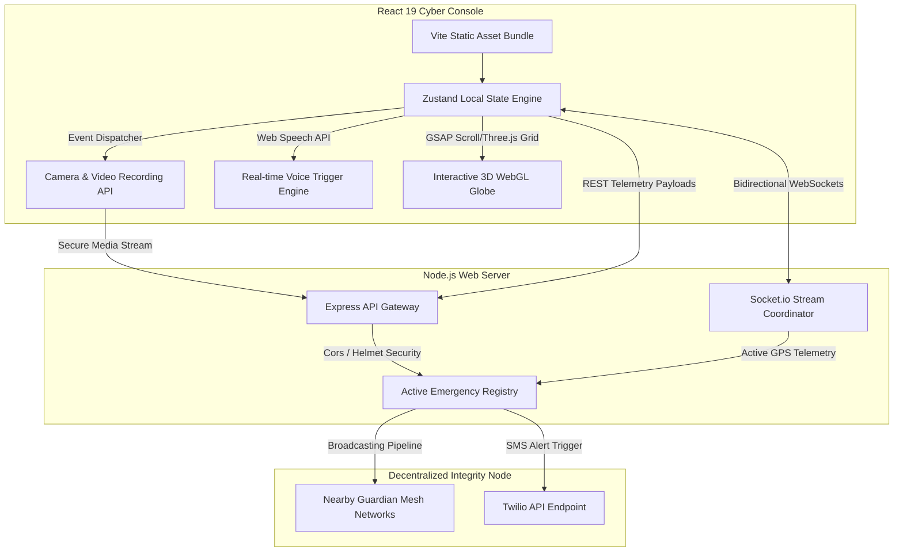

# 🛡 RAKSHA रक्षा ──── WOMEN SAFETY COMMAND SYSTEM
```
┌──────────────────────────────────────────────────────────────────────────┐
│ RAKSHA CORE SYSTEM v3.2.0 [STATUS: NOMINAL (ONLINE)]                     │
│ OPERATING SYSTEM: CYBER-EMERGENCY OS (CLIENT/SERVER)                     │
│ DEPLOYMENT COORDINATES: CENTRAL MESH BROADCAST                           │
│ SECURE PROTOCOLS: WEBSOCKET / SHIELD-AES-256 / SHA-256 PROOF             │
└──────────────────────────────────────────────────────────────────────────┘
```

An AI-Powered Futuristic Emergency Operating System and Command Console designed to provide immediate protection, real-time telemetry, and hands-free crisis containment for women. 

---

### 🌐 Live Infrastructure Telemetry

| Service Node | Deployment Host | Status Badge | Live Access Link |
| :--- | :--- | :--- | :--- |
| **RAKSHA Frontend client** | Vercel Static CDN | [](https://vercel.com) | [Open Live Client Console ↗](https://raksha-devillikevd.vercel.app) |
| **RAKSHA Backend Orchestration** | Render Web Engine | [](https://render.com) | [Inspect Node Core API ↗](https://raksha-backend.onrender.com) |
| **API Health Check** | core-engine-ping | [](https://raksha-backend.onrender.com/api/health) | [Check Server Heartbeat ↗](https://raksha-backend.onrender.com/api/health) |
| **Global Status Page** | status-monitor | [](https://status.render.com/) | [Render Infrastructure Status ↗](https://status.render.com/) |
| **Source Repository** | GitHub | [](https://github.com/devillikevd/raksha) | [Explore GitHub Repository ↗](https://github.com/devillikevd/raksha) |

---

## 🗺 System Architecture

RAKSHA operates on a fully decoupled **WebGL Cinematic Frontend** linked via continuous bidirectional WebSocket streams to an **Express/Socket.io backend orchestration core**.



---

## 🖥 Command Interface Modules

| Module Identifier | Security Rating | Functional Description | Telemetry / Event Vector |
| :--- | :--- | :--- | :--- |
| **🆘 Emergency SOS Auto-Capture** | `MAXIMUM` | Initiates 3s count. Captures 5 Canvas-stamped GPS photo frames/15s video. | `window.dispatchEvent(CustomEvent)` |
| **🧠 AI Guardian Console** | `HIGH` | Interactive chat query for route safety index values, telemetry data and decoy scripts. | `AIGuardianChat.jsx` local inference |
| **🗣 Voice Command Trigger** | `MAXIMUM` | Real-time browser speech translation mapping to crisis terms (`help`, `emergency`, `police`). | `webkitSpeechRecognition` Engine |
| **📞 Decoy Call Simulator** | `MEDIUM` | Hyper-realistic mobile phone dialer UI with timer triggers and audio waveforms. | Delayed custom trigger queue |
| **🚶 Safe Walk Escort** | `HIGH` | Path optimizer highlighting illuminated main roads (96% safety) vs. shortcuts (34% safety). | Route comparison simulation matrix |
| **🗃 TAMPER-PROOF EVIDENCE** | `CRITICAL` | Secure locker showing capture timestamps, GPS coordinates, and mock SHA-256 hashes. | `/api/evidence/upload` |
| **🛡 Community Mesh** | `HIGH` | Distributed coordinates map tracking adjacent emergency beacons and local guardians. | `Socket.io` broadcast mesh |
| **📊 Terminal Settings** | `NOMINAL` | Toggles for debug modes, notification relays, audio playback, and sensor calibrations. | `/src/stores/emergencyStore.js` |

---

## 📦 Deployment Blueprints

### ⚡ Frontend Hosting (Vercel)
The React client is built as a static Single Page Application (SPA). The repository contains `vercel.json` pre-configured to handle SPA redirects and set strict permissions policies allowing access to the camera, microphone, and geolocation API.

```json
{
  "version": 2,
  "cleanUrls": true,
  "framework": "vite",
  "rewrites": [
    { "source": "/(.*)", "destination": "/index.html" }
  ]
}
```

> [!IMPORTANT]
> **Vercel Dashboard Deployment Steps:**
> 1. Visit the **[Vercel Dashboard](https://vercel.com/)** and click **Add New > Project**.
> 2. Import the GitHub Repository: `https://github.com/devillikevd/raksha`.
> 3. Vercel automatically detects Vite framework. Ensure the build command is `npm run build` and output directory is `dist`.
> 4. Click **Deploy**. Vercel will automatically configure permissions and route rules via your `vercel.json`.

---

### 🛡 Backend hosting (Render)
The Node/Socket.io backend runs continuously. We manage and provision the services using a `render.yaml` Infrastructure-as-Code (IaC) configuration.

```yaml
services:
  # RAKSHA Backend Node/Socket.io service
  - type: web
    name: raksha-backend
    env: node
    plan: free
    rootDir: server
    buildCommand: npm install
    startCommand: npm start
    envVars:
      - key: PORT
        value: 10000
      - key: NODE_ENV
        value: production

  # RAKSHA Static Frontend service
  - type: web
    name: raksha-frontend
    runtime: static
    staticPublishPath: dist
    buildCommand: npm install && npm run build
```

> [!TIP]
> **Render Blueprint Deployment Steps:**
> 1. Open the **[Render Dashboard](https://dashboard.render.com/)**.
> 2. Click **New > Blueprint**.
> 3. Connect your GitHub repository: `https://github.com/devillikevd/raksha`.
> 4. Render will parse your `render.yaml` automatically, discover both the `raksha-backend` web service and `raksha-frontend` static site, and deploy them together instantly for free!

---

## 🔌 API & Event Specifications

### REST Telemetry Gateways

```
POST /api/sos/trigger
Content-Type: application/json

{
  "userId": "usr_99x2",
  "name": "Aradhya Sen",
  "latitude": 19.0760,
  "longitude": 72.8777,
  "contacts": [
    { "name": "Mom", "phone": "+9198XXXXXXXX" }
  ]
}
```

| HTTP Method | API Path | Payload / Parameter | System Response |
| :--- | :--- | :--- | :--- |
| `GET` | `/api/health` | None | `{ status: "nominal", uptime: 102.3 }` |
| `POST` | `/api/sos/trigger` | Telemetry Coordinate Body | `{ success: true, message: "SOS Broadcast initiated." }` |
| `POST` | `/api/evidence/upload` | Base64 Media + Metadata | `{ success: true, evidence: { id: "ev-01", hash: "sha256-x" } }` |
| `POST` | `/api/sos/resolve` | `{ userId: "usr_99x2" }` | `{ success: true, message: "Emergency resolved." }` |
| `GET` | `/api/incidents` | None | `Array<IncidentObject>` (Active feeds) |

### WebSocket Network Broadcasts

| Event Channel | Communication Direction | Payload Data | Trigger Node |
| :--- | :--- | :--- | :--- |
| `raksha-gps-stream` | **Client ──> Server** | `{ userId, latitude, longitude }` | Sends active GPS stream |
| `raksha-emergency-broadcast` | **Server ──> All Clients** | `{ userId, name, latitude, longitude }` | Alerts nearby guardians |
| `raksha-gps-delta` | **Server ──> All Clients** | `{ userId, latitude, longitude }` | Updates tracking coordinate pins |
| `raksha-evidence-updated` | **Server ──> All Clients** | `{ userId, evidence: Array<Items> }` | Broadcasts evidence locker updates |
| `raksha-emergency-resolved` | **Server ──> All Clients** | `{ userId, timestamp }` | Cleans up active emergency overlays |

---

## ⚡ Quick-Start Local Terminal Setup

### Frontend Dashboard Client
```bash
# Clone the repository
git clone https://github.com/devillikevd/raksha.git
cd raksha

# Install dependency files
npm install

# Spin up Vite local server
npm run dev
```

### Telemetry Backend Engine
```bash
# Navigate to backend directory
cd server

# Create configuration environment file
echo "PORT=5000\nNODE_ENV=development" > .env

# Install dependency files
npm install

# Start Express & Socket.io server
npm start
```

---

<div align="center">

**Built with ❤️ for RAKSHA Women Safety Initiatives**  
*RAKSHA — Intelligent, immediate protection when it matters most.*

</div>
