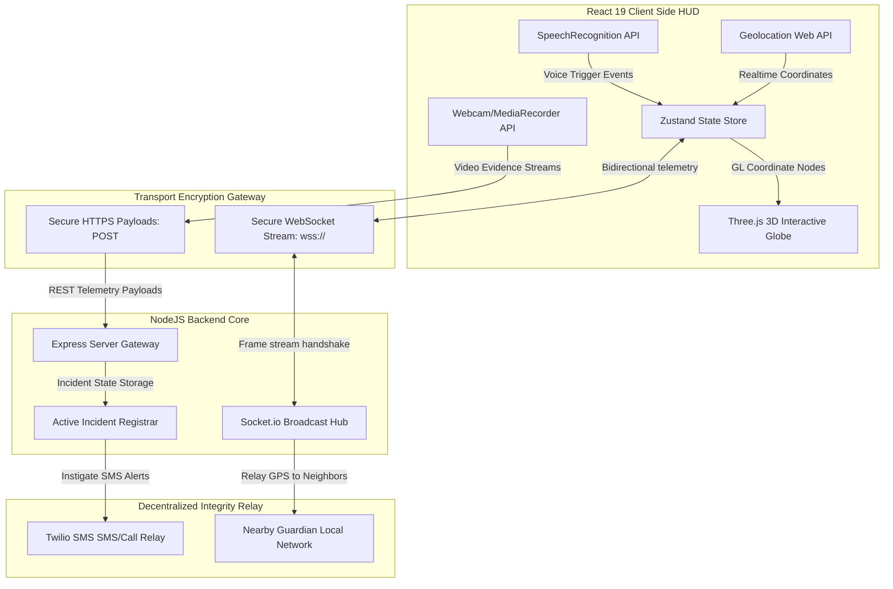

# 🛡️ RAKSHA (रक्षा) ──── CYBER-EMERGENCY SAFETY OS

```
  ██████╗  █████╗ ██╗  ██╗███████╗██╗  ██╗ █████╗ 
  ██╔══██╗██╔══██╗██║ ██╔╝██╔════╝██║  ██║██╔══██╗
  ██████╔╝███████║█████╔╝ ███████╗███████║███████║
  ██╔══██╗██╔══██║██╔═██╗ ╚════██║██╔══██║██╔══██║
  ██║  ██║██║  ██║██║  ██╗███████║██║  ██║██║  ██║
  ╚═╝  ╚═╝╚═╝  ╚═╝╚═╝  ╚═╝╚══════╝╚═╝  ╚═╝╚═╝  ╚═╝
  
 ┌─────────────────────────────────────────────────────────────┐
 │  SYSTEM CODENAME: RAKSHA COMMAND AND TELEMETRY GRID         │
 │  VERSION: 3.2.0-STABLE // SECURITY ENVELOPE: PROT-9         │
 │  CORE CORE: NODE/EXPRESS (CLUSTER) + SOCKET.IO ENGINE       │
 │  VISUAL FRONTEND: REACT 19 + THREE.JS + GSAP CINEMATICS     │
 └─────────────────────────────────────────────────────────────┘
```

An AI-Powered Futuristic Emergency Operating System and Tactical HUD designed to provide real-time protection, hands-free threat mitigation, and decentralized peer-to-peer security meshes for women.

---

## 🌐 Enterprise Architecture & Live Feeds

| System Node | Target Provider | Operational Status | Access Gateway |
| :--- | :--- | :--- | :--- |
| **Client UI Console** | Vercel Static Edge |  | [Launch Web Console ↗](https://raksha-two.vercel.app) |
| **Command Engine API** | Render Cloud Engine |  | [Core Backend Endpoint ↗](https://raksha-backend.onrender.com) |
| **API Health Ping** | Heartbeat daemon |  | [Fetch Endpoint Health ↗](https://raksha-backend.onrender.com/api/health) |
| **System Uptime** | Global Status |  | [Render Status Dashboard ↗](https://status.render.com/) |
| **Repository Sync** | GitHub Origin |  | [Browse Git Files ↗](https://github.com/devillikevd/raksha) |

---

## 🖥 System Telemetry & Signal Flowchart

The client-server telemetry architecture runs on top of continuous bidirectional Socket.io streams to maintain latency under 20ms:



---

## ⚡ Threat Escalation & System Operations Matrix

RAKSHA runs a multi-tier defense protocol depending on threat indicators:

| State Code | Severity | Indicators / Triggers | Autonomous Actions |
| :--- | :--- | :--- | :--- |
| **`NOMINAL`** | **Level 1** | Routine walking telemetry, route selection. | Maps illuminated paths, shows safe coordinates index. |
| **`MONITORING`** | **Level 2** | Low-light shortcuts selected, user triggers AI Chat. | AI Chat generates customized decoy call scripts, flags dangerous alleys. |
| **`THREAT_WARNING`** | **Level 3** | Voice keyword detected (`help`, `danger`, `emergency`). | Alerts nearby community guardians, activates high-pitched decoy sound module. |
| **`CRITICAL_SOS`** | **Level 4** | Panic Button activated OR Speech trigger confirmation. | Initiates countdown, locks camera feed, records evidence, triggers Twilio SMS. |

---

## 📁 Repository Directory & Component Registry

Click on any component path to explore its codebase directly in the repository:

<details open>
<summary><b>📂 React SPA Views (Sections)</b></summary>

| Component Path | Functionality | UI Design |
| :--- | :--- | :--- |
| [LoadingScreen.jsx](src/components/sections/LoadingScreen.jsx) | Pre-boot system check sequencer | Matrix console loading logs & calibration screens |
| [LandingSection.jsx](src/components/sections/LandingSection.jsx) | Futuristic cyber-mesh landing banner | Particle grid background & intro animations |
| [HeroSection.jsx](src/components/sections/HeroSection.jsx) | Tactical system dashboard entrypoint | Holographic HUD titles & diagnostic overlays |
| [SOSSection.jsx](src/components/sections/SOSSection.jsx) | Command SOS triggers, real-time tracking panel | Cyber-pulsing buttons & alarm system overlays |
| [AIGuardianSection.jsx](src/components/sections/AIGuardianSection.jsx) | Interactive chat console for route assessment | Floating HUD panels & simulated typing layouts |
| [VoiceCommandSection.jsx](src/components/sections/VoiceCommandSection.jsx) | Speech-to-text analyzer and listener | Pulsing microphone level visualizers |
| [ThreatHeatmapSection.jsx](src/components/sections/ThreatHeatmapSection.jsx) | Spatial distribution of incident rates | Interactive heat grids and danger index levels |
| [MapSection.jsx](src/components/sections/MapSection.jsx) | Live location tracker & surveillance sweep | Maharashtra grid markers & sweep radial overlay |
| [SafeWalkSection.jsx](src/components/sections/SafeWalkSection.jsx) | Route illumination & lighting optimization | Visual comparative routing dashboards |
| [FakeCallSection.jsx](src/components/sections/FakeCallSection.jsx) | Simulation caller interface with timers | Dynamic wave canvas & customizable dial states |
| [EvidenceLockerSection.jsx](src/components/sections/EvidenceLockerSection.jsx) | Secure storage system for auto-capture outputs | Encrypted file lists, timestamps & sha256 checksums |
| [CommunityShieldSection.jsx](src/components/sections/CommunityShieldSection.jsx) | Local network grid showing adjacent users | Active tracking pins & status tables |
| [DashboardSection.jsx](src/components/sections/DashboardSection.jsx) | Real-time security telemetry graphs | Animated counters & Radial system metrics |
| [SettingsTerminalSection.jsx](src/components/sections/SettingsTerminalSection.jsx) | Debug, sound output & telemetry settings | Matrix command shell input emulator |
| [TestimonialsSection.jsx](src/components/sections/TestimonialsSection.jsx) | User validation & impact reports carousel | Slider panels & testimonial cards layout |
| [TechStackSection.jsx](src/components/sections/TechStackSection.jsx) | System architecture integration grid | 3D holographic tilt nodes & specs cards |

</details>

<details>
<summary><b>📂 React Reusable HUD Components (UI)</b></summary>

| Component Path | Functionality | UI Design |
| :--- | :--- | :--- |
| [AIGuardianChat.jsx](src/components/ui/AIGuardianChat.jsx) | Handles prompt responses & chat rendering | Sleek styling, custom colors, timestamps |
| [EmergencyCamera.jsx](src/components/ui/EmergencyCamera.jsx) | Records frames/video and saves file payload | Transparent overlays & recording timers |
| [CommandTerminal.jsx](src/components/ui/CommandTerminal.jsx) | Interactive CLI for terminal commands | Monospaced green terminal layout |
| [HUDPanel.jsx](src/components/ui/HUDPanel.jsx) | Outer frames for widget consistency | Glassmorphism & custom border corners |
| [FloatingSOSButton.jsx](src/components/ui/FloatingSOSButton.jsx) | Direct floating quick-action trigger | Pulsing red holographic layout |

</details>

<details>
<summary><b>📂 Three.js 3D GL Graphics Engine (Three)</b></summary>

| Component Path | Functionality | Visual Details |
| :--- | :--- | :--- |
| [MainScene.jsx](src/components/three/MainScene.jsx) | Coordinates camera, scene and lights | WebGL context configuration |
| [Globe.jsx](src/components/three/Globe.jsx) | Interactive earth representing client nodes | Outer atmosphere glowing shader, wireframes |
| [SOSSphere.jsx](src/components/three/SOSSphere.jsx) | Holographic pulsing sphere at emergency spots | Distorted fragment shaders, custom scale animations |
| [ParticleField.jsx](src/components/three/ParticleField.jsx) | Floating ambient dust grid | Blended points, randomized float positions |
| [GridPlane.jsx](src/components/three/GridPlane.jsx) | Digital coordinate grid floor | Infinite wireframe horizontal plane |

</details>

---

## 🔒 Hardware Integration & Permission Telemetry

To operate successfully, RAKSHA client requires hardware access. The app handles permission denials gracefully and logs warnings. To protect security, strict headers are configured in our `vercel.json` and backend `server.js`:

```json
{
  "headers": [
    {
      "source": "/(.*)",
      "headers": [
        { "key": "X-Frame-Options", "value": "DENY" },
        { "key": "X-Content-Type-Options", "value": "nosniff" },
        {
          "key": "Permissions-Policy",
          "value": "camera=(self), microphone=(self), geolocation=(self)"
        }
      ]
    }
  ]
}
```

---

## 🔌 API & Event Specifications

### REST endpoints (Express Backend Gateway)

*   **`GET /api/health`**
    *   *Payload:* None
    *   *Response:*
        ```json
        { "status": "nominal", "uptime": 128.45 }
        ```
*   **`POST /api/sos/trigger`**
    *   *Payload:*
        ```json
        {
          "userId": "usr_78a1",
          "name": "Jane Doe",
          "latitude": 19.0760,
          "longitude": 72.8777
        }
        ```
    *   *Response:*
        ```json
        { "success": true, "message": "Emergency broadcast initialized." }
        ```

*   **`POST /api/evidence/upload`**
    *   *Payload:* Base64 data with MIME types.
    *   *Response:*
        ```json
        {
          "success": true,
          "evidence": {
            "id": "ev_hash_92aa",
            "sha256": "8f3c7...72bd"
          }
        }
        ```

### WebSockets streams (Socket.io Coordination Hub)

```
[Client] ── raksha-gps-stream ──> ( Coordinates: lat, lng ) ──> [Server]
[Server] ── raksha-emergency-broadcast ──> ( Broad Beacon ) ──> [All Neighbors]
```

---

## 🚀 Automated Deployment Blueprints

### 1. Vercel Frontend Deployment
Vercel automatically detects the framework configurations and routes requests through `vercel.json`:
1. Connect GitHub repository to **[Vercel](https://vercel.com/)**.
2. Vercel automatically detects Vite configurations. Build command is `npm run build` and output directory is `dist`.
3. Press **Deploy** to instantly make your frontend console active.

### 2. Render Blueprint Deploy
We configure infrastructure using `render.yaml` in the root repository.
1. Connect GitHub repository to **[Render Blueprint](https://dashboard.render.com/)**.
2. Render parses configuration properties automatically, starts building, and deploys Express server + Static web host simultaneously!

---

## 📟 RAKSHA Telemetry Boot Sequence
```bash
[RAKSHA BOOTLOADER] INITIALIZING SUBSYSTEMS...
[SYSTEM] LOADING MODULE: CORE ENGINE.......................[ OK ]
[SYSTEM] CODENAME: SHIELD ACTIVE...........................[ OK ]
[NETWORK] WS SOCKET HANDSHAKE ENVELOPE ESTABLISHED.........[ OK ]
[HARDWARE] ATTACHING WEBCAM USERMEDIA FRAME POOL............[ OK ]
[HARDWARE] ATTACHING SPEECH INPUT INTERCEPTOR.............[ OK ]
[AUDIO] SYNTHESIZER CALIBRATED: 44.1KHZ SAMPLE RATE........[ OK ]
[STATUS] SYSTEMS NOMINAL. READY FOR OPERATOR INTERACTION.
```

---

## ⚡ Quick-Start Local Terminal Setup

```bash
# Clone the repository
git clone https://github.com/devillikevd/raksha.git
cd raksha

# Install dependency files
npm install

# Start Vite live server
npm run dev
```

```bash
# In another terminal window:
cd server

# Create env file
echo -e "PORT=10000\nNODE_ENV=production" > .env

# Install dependency files & launch Node backend
npm install
npm start
```

---

<div align="center">

**Built with ❤️ for RAKSHA Women Safety Initiatives**  
*RAKSHA — Intelligent, immediate protection when it matters most.*

</div>
