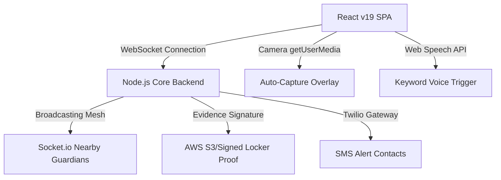

# RAKSHA रक्षा — Women Safety Command System v3.2

<div align="center">

### 🛡 An AI-Powered Futuristic Emergency Operating System for Women's Safety
**Real-Time Decentralized Guardian Network, Auto-Capture Evidence Locker, & Tactical Navigation**

[](https://react.dev)
[](https://nodejs.org)
[](https://threejs.org)
[](https://vercel.com)
[](https://render.com)

</div>

---

## 🗺 System Architecture

RAKSHA operates on a highly decoupled **Cinematic Frontend Client** linked via a secure WebSocket connection to an **Autonomous Node/Express Backend Orchestration Engine**.



---

## 🚀 Key Features

### 🆘 Emergency SOS with Auto-Capture
- **One-Touch Trigger**: 3-second custom countdown interface.
- **📸 Auto-Capture Sequence**: Automatically fires the camera to capture **5 sequential photos** with active GPS latitude, longitude, and timestamps stamped directly on the canvas as legal proof.
- **📹 Video Evidence Locker**: Records a **15-second high-fidelity video clip** (user configurable mode) with synchronized audio.
- Sends evidence data directly to configured contacts.

### 🧠 AI Guardian Console & Telemetry Chat (`AIGuardianChat`)
- **Interactive Chat Interface**: Ask security telemetry, scan sector coordinates, request decoy scripts, or call silent local backup.
- **Predictive Risk Assessment**: Computes live sector index values and highlights patrol warnings.

### 🗣 Working Web Speech AI Voice Processing (`VoiceCommandSection`)
- **Real Speech Recognition**: Links to standard browser speech processing APIs to process spoken keywords.
- **Silent Trigger matching**: Recognizes terms like *help*, *emergency*, *police*, or *bachao* to automatically launch the camera auto-capture sequence hands-free.

### 📞 Fake Call Decoy Protocol (`FakeCallSection`)
- **6 Realistic Caller Profiles** (Mom, Boss, Police, Husband, Friend, Office).
- **Delayed Trigger (0s, 5s, 10s, 30s, 60s)**: Stash your phone naturally before the decoy call rings.
- Hyper-realistic mobile phone simulator with connected duration timers and audio waveforms.

---

## ⚡ Deployment Tutorials

### 1. Frontend Deployment on Vercel
The frontend is built as a static Vite Single Page App. We have included an advanced **`vercel.json`** file that handles permission policies (allowing Camera, Mic, Geolocation) and SPA routing.

#### Option A: Deploy via Vercel Web Dashboard (Recommended)
1. Push your code to your GitHub Repository: `https://github.com/devillikevd/raksha`.
2. Open the **[Vercel Dashboard](https://vercel.com)**.
3. Click **Add New** -> **Project**.
4. Import your `raksha` repository.
5. In the Build Configuration:
   - **Framework Preset**: `Vite`
   - **Build Command**: `npm run build`
   - **Output Directory**: `dist`
6. Click **Deploy**. Vercel will automatically parse the `vercel.json` file in your root folder.

#### Option B: Deploy via Vercel CLI
```bash
# Install Vercel CLI globally
npm install -g vercel

# Run vercel deploy in workspace root
vercel --prod
```

---

### 2. Backend Deployment on Render
The RAKSHA Node/Express backend coordinates Socket.io coordinate feeds and API payloads. We have included a **`render.yaml`** Infrastructure-as-Code file to deploy seamlessly.

#### Option A: Blueprints Deployment (Recommended)
1. Go to your **[Render Dashboard](https://dashboard.render.com)**.
2. Click **New** -> **Blueprint**.
3. Link your GitHub repository.
4. Render will parse the **`render.yaml`** file and provision the resources automatically!

#### Option B: Manual Web Service Setup
1. In Render Dashboard, click **New** -> **Web Service**.
2. Link your GitHub repository.
3. Configure the Web Service:
   - **Name**: `raksha-backend`
   - **Environment**: `Node`
   - **Root Directory**: `server`
   - **Build Command**: `npm install`
   - **Start Command**: `npm start`
   - **Plan**: `Free`
4. In Advanced Settings, add the Environment Variables:
   - `PORT`: `10000`
   - `NODE_ENV`: `production`
5. Click **Create Web Service**.

---

## 🛡 Environment Configuration

Create a `.env` file inside the `/server` directory:

```env
PORT=10000
NODE_ENV=production
# Twilio credentials (optional backend triggers)
TWILIO_ACCOUNT_SID=your_sid_here
TWILIO_AUTH_TOKEN=your_token_here
TWILIO_PHONE_NUMBER=+1XXXXXXXXXX
```

---

## 🛠 API & WebSockets Event Schema

### REST Endpoints (Backend)

| Method | Endpoint | Description | Payload |
|--------|----------|-------------|---------|
| `GET` | `/api/health` | System health check | N/A |
| `POST` | `/api/sos/trigger` | Broadcasts emergency | `{ userId, name, latitude, longitude, contacts }` |
| `POST` | `/api/evidence/upload` | Logs photo/video evidence | `{ userId, base64Data, type }` |
| `GET` | `/api/incidents` | Lists active alert feeds | N/A |

### Socket.io Real-time Streams

| Event Name | Type | Payload | Description |
|------------|------|---------|-------------|
| `raksha-gps-stream` | **Emit** | `{ userId, latitude, longitude }` | Sends active user coordinates |
| `raksha-emergency-broadcast` | **Broadcast** | `{ userId, name, latitude, longitude }` | Alerts nearby guardians |
| `raksha-gps-delta` | **Broadcast** | `{ userId, latitude, longitude }` | Updates active tracker marker |

---

## 🎨 Technology Stack

- **Client**: React 19, Vite, Zustand, Tailwind CSS v4.
- **Cinematics**: GSAP (Timeline Scrolling), Framer Motion, Three.js (3D globe background), HTML Canvas.
- **Microphone & Media**: MediaRecorder API, getUserMedia API, webkitSpeechRecognition API.
- **Backend Infrastructure**: Node.js, Express, Socket.io, Helmet Security middlewares.

---

<div align="center">

**Built with ❤️ for RAKSHA Women Safety Initiatives**

*RAKSHA — Intelligent, immediate protection when it matters most.*

</div>
